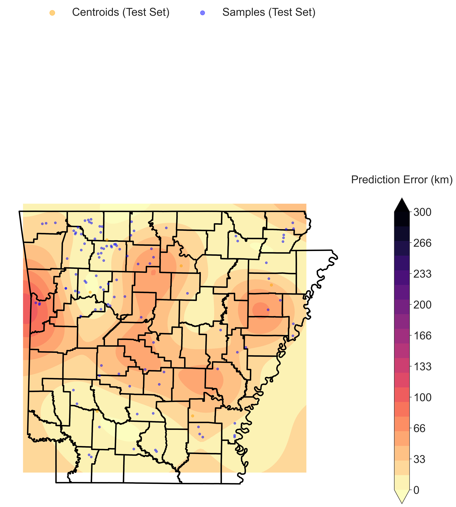
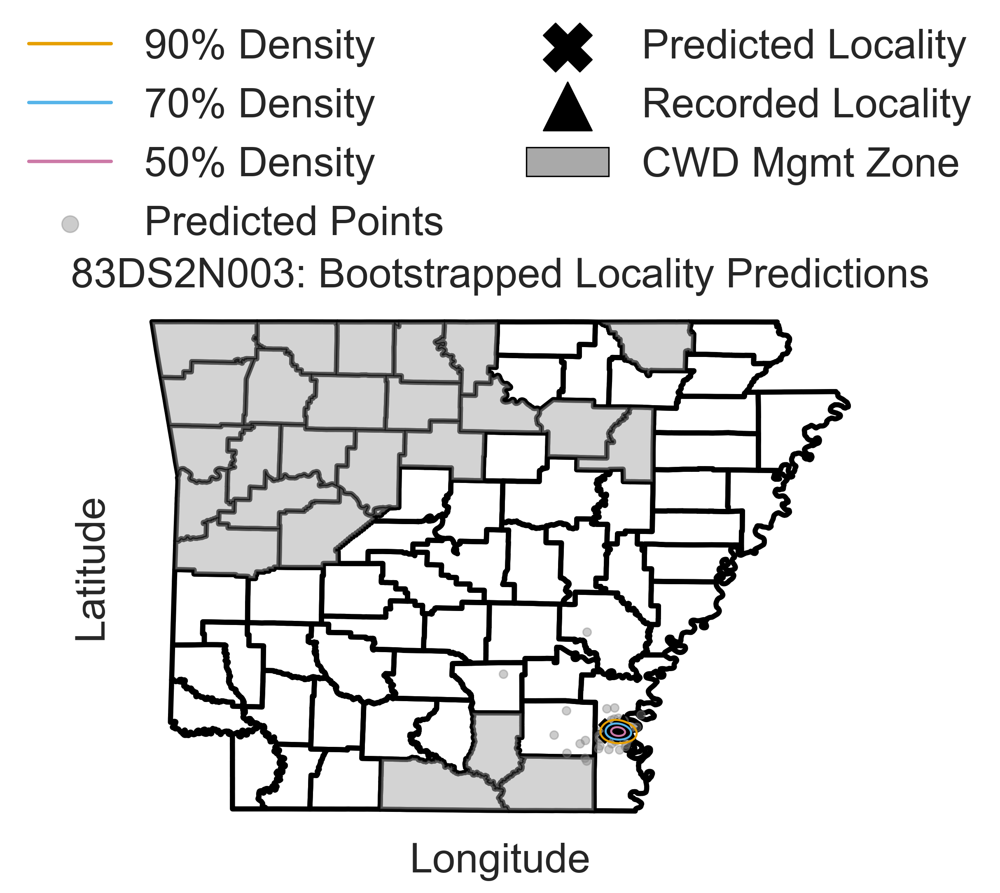
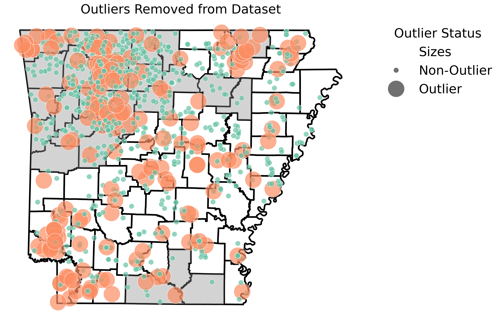
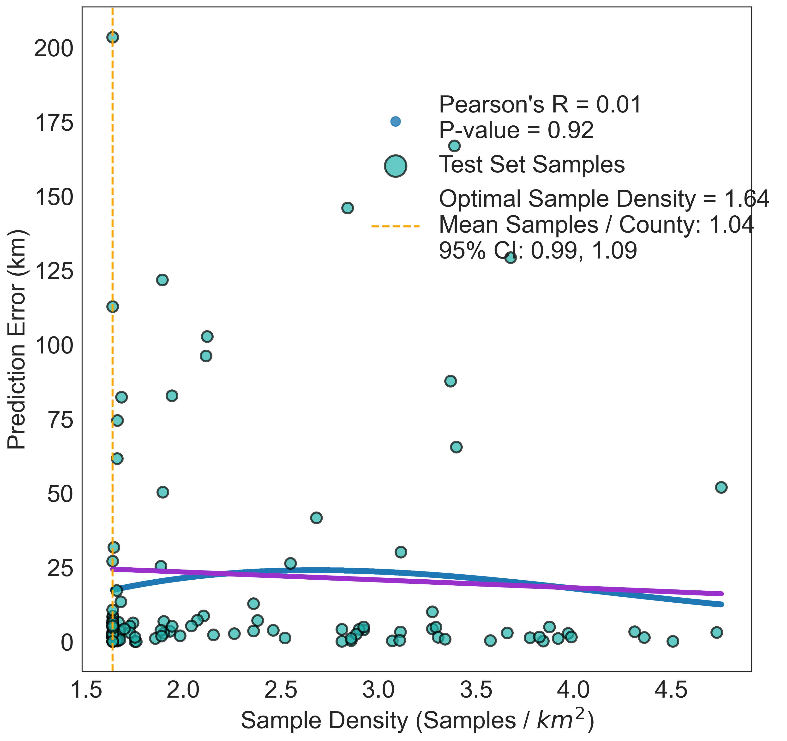
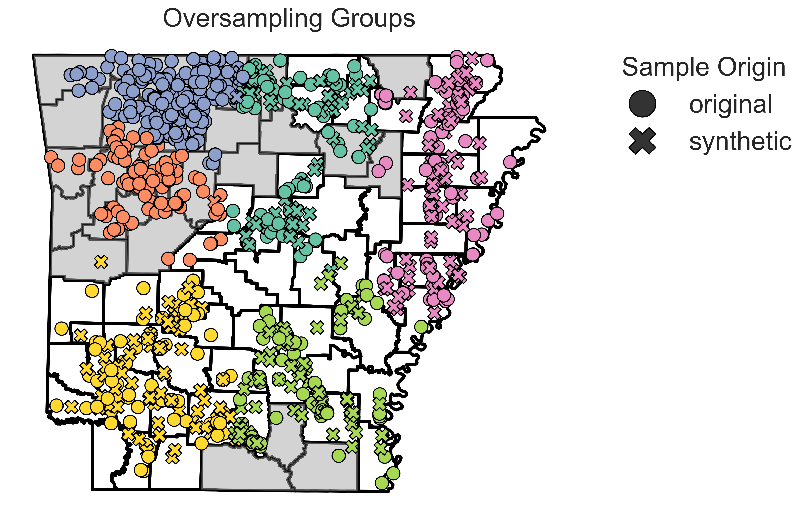
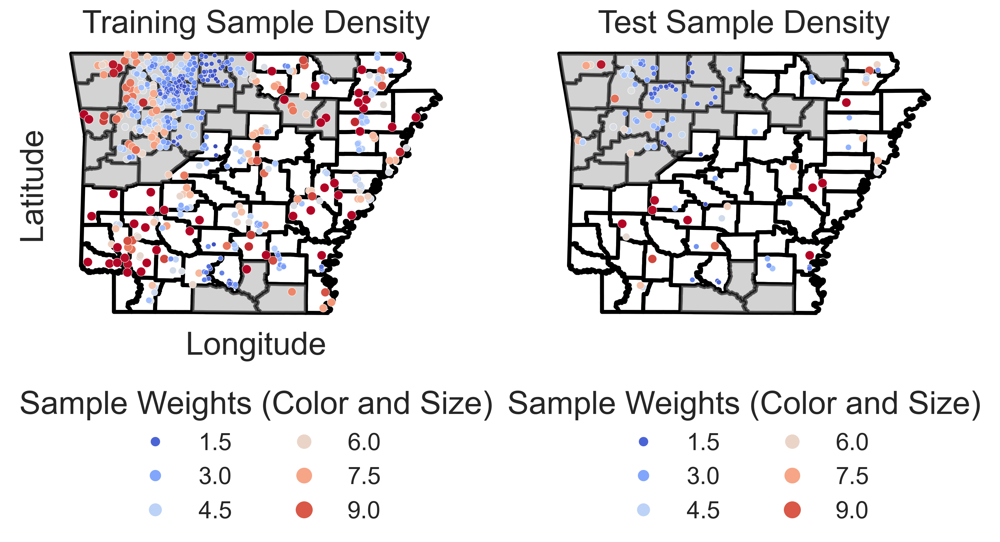
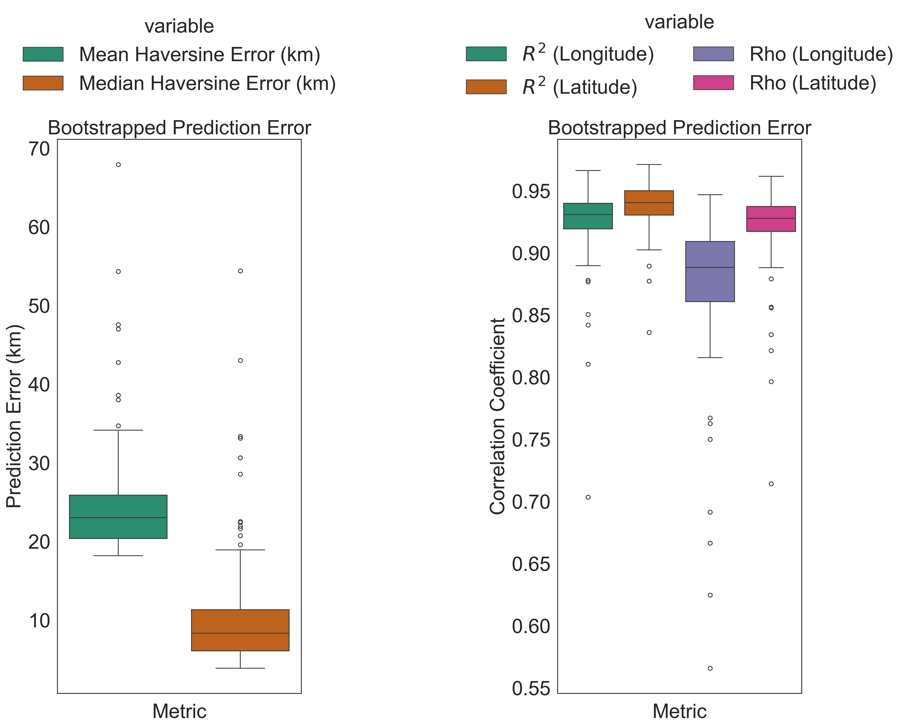
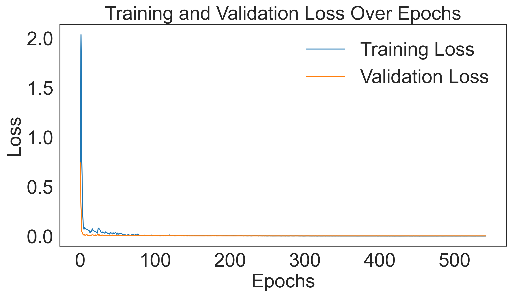

GeoGenIE Tutorial
==================

Introduction
------------
Welcome to the GeoGenIE tutorial! This guide will help you install and run GeoGenIE, a tool for predicting geographic provenance from genetic SNP data. GeoGenIE uses deep learning models to infer latitude and longitude origins from genetic data, addressing challenges like sampling imbalance and outliers.

GeoGenIE (Geographic-Genetic Inference Engine) is a sophisticated tool designed for predicting geographic provenance (i.e., latitude and longitude origin) from genetic SNP data using deep learning models. It incorporates advanced features such as:

- **Automated model parameter optimization** using Optuna :cite:p:`Akiba2020`. Optuna tunes hyperparameters to improve model performance. The parameter search is parallelized for faster optimization.
- **Outlier detection** using the algorithm adapted from GGOutlieR :cite:p:`Chang2023`.
- **Handling imbalanced sampling** with regression-based synthetic oversampling, based on the SMOTE algorithm :cite:p:`Chawla2002`, and weighted loss functions.
- **Effective Visualizations and metrics** for evaluating predictions.

GeoGenIE is tailored for researchers in population genetics and molecular ecology, addressing challenges like sampling imbalance and outliers while delivering robust geographic predictions.

Features at a Glance
---------------------
GeoGenIE combines cutting-edge methodologies to deliver accurate and reproducible results. Key features include:

- **Scalable Architecture:** Capable of handling large-scale SNP datasets with thousands of samples.
- **Geospatial Mapping:** Provides informative maps of predicted versus actual sample locations.
- **Customizable Outputs:** Supports tailored metrics and visualizations based on user-defined parameters.
- **Parallelized Bootstrapping:** Offers built-in methods for robust model validation and uncertainty estimation. Bootstrapping is parallelized for faster execution.

Deep Learning Model Architecture
--------------------------------
GeoGenIE's deep learning architecture builds on Locator :cite:p:`Battey2020`, leveraging the flexibility of PyTorch. It incorporates:

- **Dynamic Neural Network Architecture:** Configurable hidden layers with progressive reduction controlled by `--factor`.
- **Regularization Techniques:** Includes dropout, batch normalization, and L2 regularization to enhance model generalizability.
- **Custom Loss Functions:** Supports RMSE, Huber, and DRMS Loss to address specific prediction challenges.

Installation
------------

Steps to Install GeoGenIE
~~~~~~~~~~~~~~~~~~~~~~~~~~

1. **Create a virtual or conda environment:**
    .. code-block:: bash

        python -m venv geogenie_env
        source geogenie_env/bin/activate

2. **Install GeoGenIE:**
    .. code-block:: bash

        pip install GeoGenIE

Dependencies
~~~~~~~~~~~~

Dependencies like PyTorch, geopandas, scikit-learn, matplotlib, scipy, pykrige, numpy, and many others are automatically installed. Ensure Python ≥ 3.11 is used.

Usage
-----

Running GeoGenIE
~~~~~~~~~~~~~~~~

GeoGenIE can be run via:

- **YAML Configuration File** (recommended):
    .. code-block:: bash

        geogenie --config config_files/config.yaml

- **Command-Line Arguments:**
    .. code-block:: bash

        geogenie --vcf <vcf_file> --sample_data <coordinates_file>

Run ``geogenie -h`` to see all available arguments.

Configuration File Format
~~~~~~~~~~~~~~~~~~~~~~~~~~

- Boolean values: ``true`` or ``false``.
- `None` values: ``null``.

Input Files
-----------

+----------------------+----------------------------------------------------------+
| **Argument**         | **Description**                                          |
+======================+==========================================================+
| **vcf**              | VCF file with SNP data.                                  |
+----------------------+----------------------------------------------------------+
| **sample_data**      | CSV/TSV file with sample coordinates (sampleID, x, y).   |
|                      | Unknowns as ``nan``.                                     |
+----------------------+----------------------------------------------------------+
| **known_coords_file**| File with known coordinates for samples.                 |
+----------------------+----------------------------------------------------------+

Algorithms to Mitigate Sampling Imbalance
-----------------------------------------

GeoGenIE addresses sampling imbalances with:

1. **Outlier Detection:** Removes anomalous samples (e.g., due to translocations).
2. **Weighted Loss Function:** Focuses training on underrepresented regions.
3. **Synthetic Oversampling:** Creates synthetic samples in sparsely sampled areas.

Features and Settings
----------------------

Data Input and Preprocessing
~~~~~~~~~~~~~~~~~~~~~~~~~~~~

+-------------+-----------------------------------------------------+-----------------+
| **Option**  | **Description**                                     | **Default**     |
+=============+=====================================================+=================+
| **min_mac** | Filters SNPs with minor allele counts below a       | 2               |
|             | threshold.                                          |                 |
+-------------+-----------------------------------------------------+-----------------+
| **max_SNPs**| Limits the number of SNPs used in analysis.         | Use all SNPs    |
+-------------+-----------------------------------------------------+-----------------+

Model Configuration
~~~~~~~~~~~~~~~~~~~

+------------------+-------------------------------------------------------+-------------+
| **Option**       | **Description**                                       | **Default** |
+==================+=======================================================+=============+
| **dropout_prop** | Dropout rate to prevent overfitting.                  | 0.25        |
+------------------+-------------------------------------------------------+-------------+
| **n_layers**     | Number of hidden layers in the neural network.        | 10          |
+------------------+-------------------------------------------------------+-------------+
| **width**        | Neurons per layer.                                    | 256         |
+------------------+-------------------------------------------------------+-------------+
| **criterion**    | Loss function (rmse, huber, drms).                    | "rmse"      |
+------------------+-------------------------------------------------------+-------------+

Tips:
~~~~~

.. note::
    - Start with default settings. Then adjust based on model performance.
    - Adjust ``dropout_prop`` for overfitting.
    - Increase ``n_layers`` for complex data.
    - Adjust ``width`` based on data complexity.
    - Use ``criterion`` to select the loss function.
    - Set ``min_mac`` based on data quality.
    - Use ``max_SNPs`` to limit the number of SNPs.
    - Use the ``known_coords_file`` to validate predictions. This file can be the same as the ``sample_data`` file.

Training Parameters
~~~~~~~~~~~~~~~~~~~

+--------------------------+---------------------------------------------+-------------+
| **Option**               | **Description**                             | **Default** |
+==========================+=============================================+=============+
| **max_epochs**           | Maximum training cycles.                    | 5000        |
+--------------------------+---------------------------------------------+-------------+
| **learning_rate**        | Learning rate for weight updates.           | 0.001       |
+--------------------------+---------------------------------------------+-------------+
| **train_split**          | Proportion of data for training.            | 0.8         |
+--------------------------+---------------------------------------------+-------------+
| **val_split**            | Proportion of data for validation set.      | 0.2         |
+--------------------------+---------------------------------------------+-------------+
| **early_stop_patience**  | Epochs without improvement before stopping. | 48          |
+--------------------------+---------------------------------------------+-------------+
| **batch_size**           | Number of samples processed per iteration.  | 32          |
+--------------------------+---------------------------------------------+-------------+
| **l2_reg**               | L2 regularization parameter.                | 0.0         |
+--------------------------+---------------------------------------------+-------------+
| **factor**               | Factor for hidden layer size reduction.     | 0.5         |
+--------------------------+---------------------------------------------+-------------+
| **lr_scheduler_patience** | Patience for learning rate scheduler.      | 10          |
+--------------------------+---------------------------------------------+-------------+
| **dtype**                | Data type for model (float32, float64).     | "float32"   |
+--------------------------+---------------------------------------------+-------------+
| **grad_clip**            | Enable graadient clipping.                  | False       |
+--------------------------+---------------------------------------------+-------------+

.. note::
    - Set ``max_epochs`` high and rely on early stopping to prevent overfitting. The default will suffice in most circumstances.
    - Use ``early_stop_patience`` to control how quickly early stopping occurs.
    - Adjust ``learning_rate`` based on model performance.
    - Use ``train_split`` and ``val_split`` to control training and validation data proportions. The default is 80/20. Make sure they sum to 1.0.
    - Set ``batch_size`` based on available memory and model performance.
    - Use ``l2_reg`` to prevent overfitting.
    - Adjust ``factor`` to control hidden layer size reduction.
    - Set ``lr_scheduler_patience`` to control learning rate decay.
    - Use ``dtype`` to set the model data type.
    - Enable ``grad_clip`` to prevent exploding gradients.

Outlier Detection
~~~~~~~~~~~~~~~~~

+------------------------+----------------------------------------------+-------------+
| **Option**             | **Description**                              | **Default** |
+========================+==============================================+=============+
| **detect_outliers**    | Enables outlier detection.                   | False       |
+------------------------+----------------------------------------------+-------------+
| **min_nn_dist**        | Minimum distance to flag outliers.           | 1000        |
+------------------------+----------------------------------------------+-------------+
| **significance_level** | Statistical significance threshold.          | 0.05        |
+------------------------+----------------------------------------------+-------------+
| **maxk**               | Max number of neighbors for outlier test.    | 10          |
+------------------------+----------------------------------------------+-------------+

Bootstrapping
~~~~~~~~~~~~~

Enable bootstrapping for confidence intervals with:

.. code-block:: bash

    geogenie --do_bootstrap --nboots 100

Confidence interval plots are saved in ``<output_dir>/plots/bootstrapped_sample_ci``.

Hyperparameter Optimization
~~~~~~~~~~~~~~~~~~~~~~~~~~~

Optuna optimizes model hyperparameters automatically. The process is fully parallelized across multiple CPUs to speed up computation. The best parameters are saved in JSON format and can be reloaded in future analyses.

Optimize model hyperparameters with Optuna:

+----------------------+---------------------------------------------+-------------+
| **Option**           | **Description**                             | **Default** |
+======================+=============================================+=============+
| **do_gridsearch**    | Perform search for optimal hyperparameters  | False       |
+----------------------+---------------------------------------------+-------------+
| **n_iter**          | Number of optimization iterations.           | 100         |
+----------------------+---------------------------------------------+-------------+
| **sqldb**            | Path to SQLite database for Optuna.         | None        |
+----------------------+---------------------------------------------+-------------+
| **load_best_params** | Load best parameters from Optuna.           | None        | 
+----------------------+---------------------------------------------+-------------+

Plot Settings
~~~~~~~~~~~~~

+--------------------+---------------------------------------------+-------------+
| **Option**         | **Description**                             | **Default** |
+==================+===============================================+=============+
| **show_plots**     | Display plots interactively.                | False       |
+--------------------+---------------------------------------------+-------------+
| **fontsize**       | Font size for plots.                        | 24          |
+--------------------+---------------------------------------------+-------------+
| **filetype**       | File format for saved plots (e.g., png).    | "png"       |
+--------------------+---------------------------------------------+-------------+
| **output_dir**     | Directory for saving output files.          | "output"    |
+--------------------+---------------------------------------------+-------------+
| **prefix**         | Prefix for output files.                    | "geogenie"  |
+--------------------+---------------------------------------------+-------------+
| **remove_splines** | Remove plot axis spines.                    | False       |
+--------------------+---------------------------------------------+-------------+
| **plot_dpi**       | Dots per inch for saved plots.              | 300         |
+--------------------+---------------------------------------------+-------------+
| **filetype**       | File format for saved plots (png, pdf, jpg) | "png"       |
+--------------------+---------------------------------------------+-------------+
| **shapefile**      | URL or path to shapefile for plotting.      | None        |
+--------------------+---------------------------------------------+-------------+
| **basemap_fips**   | FIPS code for basemap.                      | "US"        |
+--------------------+---------------------------------------------+-------------+

Plot Examples
~~~~~~~~~~~~~

Below are examples of some of the plots generated by GeoGenIE:

    
    Geographic Error interpolated across the landscape with Kriging. The color scale represents Haversine distance between the predicted and recorded localities, in kilometers. Blue circles represnet the recorded sample locations.

    
    Confidence intervals for a representive sample among 100 bootstrap replicates. Gray circles represent the predicted sample locations, the "X" marks the centroid of the bootstrap replicates, and the black filled triangle represents the recorded sample location. The contours represent varying levels of bootstrap prediction densities.

    
    Detected outlier samples based on samples that deviate from expected genetic and geographic patterns. Outliers are flagged based on the minimum nearest neighbor distance and statistical significance threshold. The large orange circles represent removed outlier samples.

    
    Scatter plot of predicted versus recorded sample locations. The trend lines represents the linear and polynomial regression fit. The color scale represents the density of samples. The Pearson and Spearman correlation coefficients are displayed.

    
    Synthetic samples generated by the SMOTE-based algorithm to balance the distribution of samples across geographic space. The synthetic samples are shown as "x" marks. Real samples are shown as circles. The colors represent the samples grouped with the K-means clustering algorithm.

    
    Geographic distribution of samples in the test set. Circles represent sample locations, and the color scale and size of each point represents the inverse density of samples in the area, with larger and darker circles indicating higher inverse sample densities.

    
    (Left subplot) Box plots of prediction errors for bootstrapped samples. The box represents the interquartile range, the line represents the median, and the whiskers represent the range of values. (Right subplot) Boxplots of Pearson and Spearman correlation coefficients for bootstrapped samples. Correlation coefficients are calculated between longitude and latitude of predicted and recorded sample locations.

    
    Training and validation loss over epochs. The training loss is shown in blue, and the validation loss is shown in orange. The plot demonstrates the convergence of the model during training.

These plots provide insights into the model's performance, error distributions, and geographic predictions. There are also additional plots not shown here available for visualizing model outputs and performance metrics.

Various aspects of the plots can be adjusted per user preference. For example, the font size, file type, and output directory can be customized to suit specific requirements, among other settings. See the ``config.yaml`` file for more options.

Output Files
------------

Outputs are saved in ``<output_dir>/<subdirectory>/<prefix>_*``. Directory structure:

+-----------------------------+-----------------------------------------------+
| **Subdirectory**            | **Description**                               |
+=============================+===============================================+
| **plots/**                  | Visualizations like error distributions.      |
+-----------------------------+-----------------------------------------------+
| **bootstrapped_sample_ci/** | Per-sample bootstrap CI plots                 |
+-----------------------------+-----------------------------------------------+
| **models/**                 | Trained PyTorch models (``.pt`` files).       |
+-----------------------------+-----------------------------------------------+
| **logfiles/**               | Logs (INFO, WARNING, ERROR).                  |
+-----------------------------+-----------------------------------------------+
| **bootstrap_metrics/**      | Metrics for bootstrapped analysis             |
+-----------------------------+-----------------------------------------------+
| **bootstrap_predictions/**  | Predictions for bootstrapped samples.         |
+-----------------------------+-----------------------------------------------+
| **bootstrapped_summaries/** | Aggregated summaries of bootstrapped samples. |
+-----------------------------+-----------------------------------------------+
| **data/**                   | Detected outlier samples                      |
+-----------------------------+-----------------------------------------------+
| **optimize/**               | Optuna optimization logs                      |
+-----------------------------+-----------------------------------------------+
| **predictions/**            | Predictions for all unknown samples           |
+-----------------------------+-----------------------------------------------+
| **test/**                   | Test set predictions for model evaluation     |
+-----------------------------+-----------------------------------------------+
| **training/**               | Training set metrics from model evaluation    |
+-----------------------------+-----------------------------------------------+
| **validation/**             | Validation set metrics from model evaluation  |
+-----------------------------+-----------------------------------------------+
| **benchmarking/**           | Benchmarking results (per bootstrap)          |
+-----------------------------+-----------------------------------------------+

Metric Descriptions
-------------------

GeoGenIE provides the below metrics for evaluating model performance:

- **Root Mean Squared Error (RMSLE):** RMSE used in the loss function. Calculates the square root of the mean squared error between predicted and recorded values.
- **Mean Distance**: Average Haversine distance between predicted and actual locations, in kilometers.
- **Median Distance**: Median Haversine distance between predicted and actual locations, in kilometers.
- **Standard Deviation of Distance**: Standard deviation of Haversine distances between predicted and actual locations, in kilometers.
- **Kolmogorov-Smirnov Statistic**: Measures the similarity of two distributions.
- **Kolmogorov-Smirnov p-value**: Statistical significance of the Kolmogorov-Smirnov test.
- **Skewness**: Measure of asymmetry in the distribution of prediction errors.
- **Pearson Correlation**: Measures the strength and direction of a linear relationship.
- **Spearman Correlation**: Measures the strength and direction of a monotonic relationship.
- **Mean Absolute Z-Score**: Average absolute z-score of prediction errors.
- **Percentile 25**: 25th percentile of prediction errors.
- **Percentile 50**: 50th percentile of prediction errors.
- **Percentile 75**: 75th percentile of prediction errors.
- **Percent Within 20km**: Percentage of predictions within 20km of actual locations.
- **Percent Within 50km**: Percentage of predictions within 50km of actual locations.
- **Percent Within 75km**: Percentage of predictions within 75km of actual locations.
- **Mean Absolute Deviation (MAD) of Haversine Distance**: Average absolute deviation of Haversine distances between predicted and actual locations, in kilometers.
- **Coefficient of Variation**: Measure of relative variability.
- **Interquartile Range**: Range between the 25th and 75th percentiles.

Conclusion
----------

GeoGenIE is a powerful tool for predicting geographic provenance from genetic SNP data. It offers advanced features like outlier detection, weighted loss functions, and synthetic oversampling to handle sampling imbalances. With a scalable architecture, customizable outputs, and parallelized bootstrapping, GeoGenIE delivers accurate and reproducible results. By leveraging deep learning models and Optuna hyperparameter optimization, GeoGenIE provides robust geographic predictions for researchers in population genetics and molecular ecology.

Glossary
--------

Key terms include:

- **Dropout:** A technique to prevent overfitting by randomly ignoring neurons.
- **Weighted Loss Function:** Focuses on underrepresented data.
- **Haversine Formula:** Calculates distances on a sphere using lat/long.
- **SMOTE:** Synthetic oversampling to balance data.
- **Bootstrapping:** Resampling technique for estimating confidence intervals.
- **Outlier Detection:** Identifies unusual samples using statistical methods.
- **Deep Learning:** Neural networks with multiple hidden layers.
- **Optuna:** Hyperparameter optimization framework.
- **GGOutlieR:** R package for identifying unusual geo-genetic patterns.
- **Synthetic Minority Over-sampling Technique (SMOTE):** Balances imbalanced data.
- **Locator:** Software for predicting geographic location from genetic data.
- **PyTorch:** Deep learning library for Python.
- **DRMS Loss:** Distance Root Mean Square loss function.
- **Huber Loss:**  Loss function for regression that combines RMSE and MAE.
- **Batch Normalization:** Normalizes inputs to improve training.
- **Minor Allele Count (MAC):** Number of minor alleles in a population.
- **Early Stopping:** Stops training when model performance plateaus.
- **Confidence Interval:** Range of values where true value is likely to fall.
- **Font Size:** Size of text in plots.
- **File Type:** Format for saving plots (e.g., png).
- **Significance Level:** Threshold for statistical significance.
- **Output Directory:** Folder for saving results.
- **Subdirectory:** Folder within the output directory.
- **Prefix:** Prefix for output files. 
- **Learning Rate** Rate at which model weights are updated.
- **Training Split:** Proportion of data used for training.
- **Early Stop Patience:** Number of epochs without improvement before stopping.
- **Minimum Nearest Neighbor Distance:** Minimum distance to flag outliers.
- **Statistical Significance Threshold:** Threshold for outlier detection.
- **Bootstrap:** Resampling technique for estimating confidence intervals.
- **Error Distribution:** Distribution of prediction errors.
- **Model Directory:** Folder for saving trained models.
- **Log Directory:** Folder for saving logs.
- **Visualizations:** Graphical representations of data.
- **Error Metrics:** Measures of model performance.
- **Prediction Error:** Difference between predicted and actual values.
- **Monotonic Relationship:** Relationship where one variable increases as the other decreases.
- **Distance Calculation:** Calculation of distances between points.
- **Percentage Within Distance:** Percentage of predictions within specified distances.
- **Hyperparameter Optimization:** Process of tuning model parameters to improve performance.
- **Sampling Imbalance:** Unequal distribution of data.
- **Anomalous Samples:** Unusual or outlying data points.
- **Translocations:** Movement of samples to different locations.
- **Underrepresented Regions:** Areas with few samples.
- **Synthetic Samples:** Artificially generated data points.
- **Error Distributions:** Distribution of prediction errors.
- **Interactively:** In a way that allows user interaction.
- **Saved Plots:** Graphical representations of data saved to files.
- **Directory Structure:** Organization of files and folders.
- **L2 Regularization:** Technique to prevent overfitting by penalizing large weights.
- **Batch Size:** Number of samples processed in each training iteration.
- **Epoch:** One complete pass through the training data.
- **Training Cycle:** Iteration of training epochs.
- **Neurons:** Units in a neural network that process input data.
- **Hidden Layers:** Layers between input and output layers in a neural network.
- **Overfitting:** Model that performs well on training data but poorly on test data.
- **Loss Function:** Measures the difference between predicted and actual values.
- **Synthetic Oversampling:** Technique to balance data by generating synthetic samples.
- **Parallelized:** Process that runs multiple tasks simultaneously.
- **Reproducible Results:** Results that can be replicated by others.
- **Geographic Provenance:** Origin or source of geographic data.
- **Deep Learning Models:** Neural networks with multiple layers.
- **Scalable Architecture:** Design that can handle large datasets.
- **Customizable Outputs:** Outputs that can be tailored to user needs.
- **Parallelized Bootstrapping:** Resampling technique that runs in parallel.
- **Robust Geographic Predictions:** Accurate and reliable geographic inferences.
- **Population Genetics:** Study of genetic variation within populations.
- **Molecular Ecology:** Study of genetic variation in ecological contexts.
- **Sampling Imbalances:** Unequal distribution of samples.
- **Outliers:** Unusual or extreme data points.
- **Weighted Loss Functions:** Loss functions that focus on specific data points.

References
----------

.. bibliography:: references.bib
    :cited:
